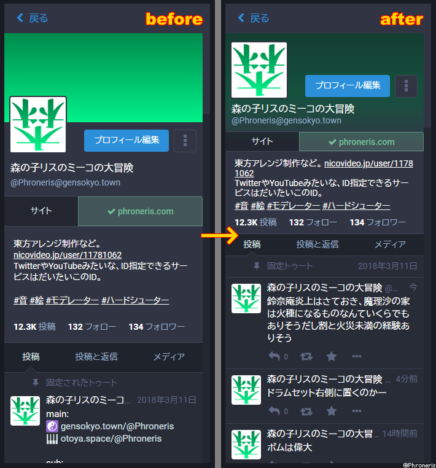
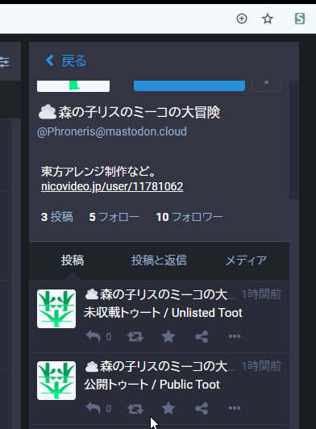
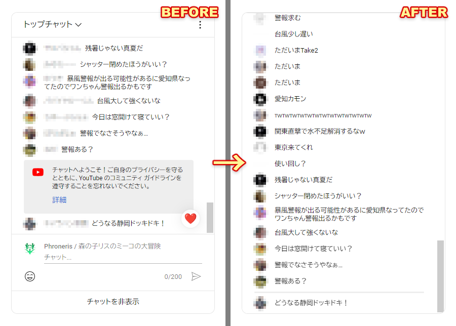
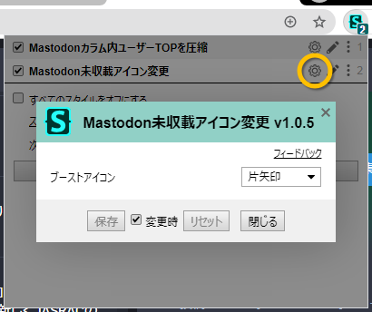

Stylus用UserCSS（森）
====

| Mastodonカラム内ユーザーTOPを圧縮 | Mastodon未収載アイコン変更 |
|:---------------------------------:|:--------------------------:|
|  |  （GIFアニメ） |

| YouTubeLiveコメント一覧カスタム |
|:-------------------------------:|
|  |

----

# 1. 概要

Chrome/Firefox/Opera向けブラウザ拡張機能 [Stylus](https://add0n.com/stylus.html) で使える上書きCSS。  
良ければ持ってって。

# 2. 利用方法

## 2-0. Stylusのインストール

まず大前提として、ブラウザにStylusを導入する。

- **Chrome**: https://chrome.google.com/webstore/detail/stylus/clngdbkpkpeebahjckkjfobafhncgmne
  - 上記が利用不能な場合は[β版](https://chrome.google.com/webstore/detail/stylus-beta/apmmpaebfobifelkijhaljbmpcgbjbdo)の方を。
- **Firefox**: https://addons.mozilla.org/ja/firefox/addon/styl-us/
- **Opera**: https://addons.opera.com/ja/extensions/details/stylus/

## 2-1. UserCSSの追加

以下の各リンクから使いたいものを開くと突然インストール画面に飛ぶので、そこで「インストール」を押せばただちに追加が完了する。はず。

| 名前、リンク                                           | 対象サイト | 概要、効果 |
|--------------------------------------------------------|------------|------------|
| [Mastodonカラム内ユーザーTOPを圧縮][Mstdn-CmprsUsTp]   | Mastodon   | カラム表示時のユーザーページの上部を色々と圧縮表示
| [Mastodon未収載アイコン変更][Mstdn-UnlstdIcn]          | Mastodon   | 未収載トゥートのブーストアイコンを、公開トゥートとは別のものに変更してわかりやすくする
| [TogetterコメNG][Tgttr-CmntNG]                         | Togetter   | コメント欄の特定ユーザーのアイコンと名前とIDを黒塗り
| [YouTubeLiveコメント一覧カスタム][YTbLv-CmntLst]       | YouTube&nbsp;Live | コメント一覧のパーツ削除、高さ変更、ユーザー名省略（マウスオーバーで表示）など

[Mstdn-CmprsUsTp]: usercss/mastodon_compress-usertop.user.styl?raw=true
[Mstdn-UnlstdIcn]: usercss/mastodon_unlisted-icon.user.styl?raw=true
[Tgttr-CmntNG]: usercss/togetter_comment-ng.user.styl?raw=true
[YTbLv-CmntLst]: usercss/youtubelive_comment-list.user.styl?raw=true

もしStylus導入済みの環境で上記の直リンクが上手くはたらかない場合、各スタイル（`/usercss`フォルダ下の`*.user.styl`ファイル）をGitHub上で開き、そのページの「Raw」ボタンから生ファイルを直接開けば、同じようにインストール画面が現れる。はず。

（それでも上手くいかない場合はこちら）

### 2-1-1. Web上からコピペで手動追加する方法

上記の方法が上手くいかない場合、以下の手順でどうぞ。

1. お目当てのファイルをGitHub上で開いて、中身のコードを全てコピーする。
2. Stylusの管理ページで、**「UserCSSとして」にチェックを入れてから**「新スタイルを作成」を押す。
3. 新スタイルの編集画面が表示され、そこに色々とテンプレート用のコードが書かれているが、それらを全て削除して先ほどコピーしたコードを貼り付ける。
4. 保存する。

### 2-1-2. ローカルに保存して手動追加する方法

Web上からの方法すら上手くいかない場合、以下の手順でどうぞ。

1. お目当てのファイルやこのリポジトリ全体をローカルに保存する。
2. Stylusの管理ページで、バックアップ関連のメニューから「スタイルをインポート」を選択する。
3. お目当てのファイルを開く。なお、全ての拡張子のファイルを表示していないとファイルが見つからないかもしれない。
4. インストール画面に飛ぶので、そこで「インストール」を押す。

## 2-2. 実際の利用

追加されれば、対象サイト上ですぐに効果を発揮する。

なお、対象サイトで効果が出ている状態でStylusの拡張機能アイコンを押すと、現在効いている各スタイル名が表示される。  
そして、その右にある歯車マークを押せば、スタイルごとに**柔軟なオプション指定**ができる。  
これが超便利なので、導入後は是非ご確認を。

## 2-3. 諸注意

- Mastodon用のUserCSSの場合、効果対象のサイトをStylus内のコードエディタ上で手動指定する必要がある…かも。

# 3. 更なるカスタム

もしまだ何か満足できず、自分で中身を直接記述したくなった場合は、拡張機能の管理画面から各スタイルをクリックすると専用のエディタが立ち上がって編集可能になるので、まあ是非。

記述の際は、オプション機能の[詳細仕様ページ](https://github.com/openstyles/stylus/wiki/UserCSS)や、Stylus（CSSメタ言語としての方）の[公式リファレンスページ](http://stylus-lang.com/)などが大いに参考になるはず。何もかも英語だけど…。

注意事項として、個人的に悪いハマリをした経験を1つだけ書いておきたい。  
**インデントにタブ文字と半角スペースが混在しているとそれだけでエラーが出て、しかもエラーがそういう理由を教えてくれなかったりする**ので、インデントに使う空白文字の統一性にはご注意を。  
専用エディタのカラーテーマにはタブ文字を可視化してくれるものもあるので、そういった部分で予防は可能。  
（オプションのStylelintルールで `"indentation": "tab"` と指定すれば監視できるかと思ったりもしたけど、インデントの深さがCSSとして監視されてエラー祭りになるので駄目だった）

# 4. その他

## 4-1. ライセンス

個別に断りがない限り、[CC0-1.0](http://creativecommons.org/publicdomain/zero/1.0/deed.ja)。

## 4-2. 作者環境（READMEの内容もこれに準ずる）

- Windows 7 64bit
- Google Chrome 64bit
- 日本語

## 4-3. 作者

- 森の子リスのミーコの大冒険（Phroneris）
