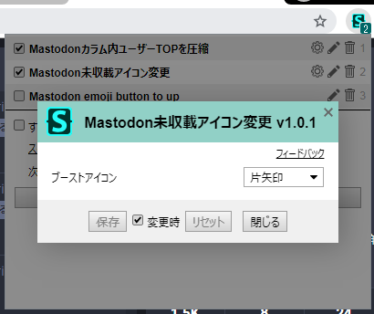

# 1. 概要

Chrome/Firefox/Operaで使えるブラウザ拡張機能「[Stylus](https://add0n.com/stylus.html)」で、自分が使っている上書きCSS（の一部）。  
よろしければご自由にお使いください。  

各ブラウザ用Stylusはこちら。
+ Chrome: https://chrome.google.com/webstore/detail/stylus/clngdbkpkpeebahjckkjfobafhncgmne
+ Firefox: https://addons.mozilla.org/ja/firefox/addon/styl-us/
+ Opera: https://addons.opera.com/ja/extensions/details/stylus/

# 2. 利用方法

## 2-1. Stylusへの追加

私がここで公開している各スタイル（`/usercss/*.user.css`）は、色々な方法でお手元のブラウザ内のStylusに追加できる。  
以下、既に上記リンク先などからStylus自体の導入が済んでいるものとして、各スタイルの追加方法を示す。

### 2-1A.【推奨】Web上からの最速追加方法

以下の各リンクを開くと突然インストール画面に飛び、そこで「インストール」を押せばただちに追加が完了する。はず。

+ [![Install directly with Stylus][1] Mastodonカラム内ユーザーTOPを圧縮](usercss/mastodon_compress-usertop.user.css?raw=true)
+ [![Install directly with Stylus][1] Mastodon未収載アイコン変更](usercss/mastodon_unlisted-icon.user.css?raw=true)
+ [![Install directly with Stylus][1] Togetter「興味ありそう」内の広告削除](usercss/togetter_no-recommend-ads.user.css?raw=true)
+ [![Install directly with Stylus][1] TogetterコメNG（アイコン、名前、IDを黒塗り）](usercss/togetter_user-ng.user.css?raw=true)
+ [![Install directly with Stylus][1] YouTubeLiveコメント一覧カスタム](usercss/youyubelive_comment-list.user.css?raw=true)
[1]: https://img.shields.io/badge/Install%20directly%20with-Stylus-238b8b.svg

もしStylus導入済みの環境で上記の直リンクが上手くはたらかなかったら、GitHub上の各ファイルの「Raw」などから`/user/*.user.css`の生ファイルを直接開くことで同じ効果が発動する。はず。

### 2-1B. Web上からコピペで手動追加する方法

最速方法が上手くいかない場合、以下の手順でどうぞ。
1. お目当てのファイルをGitHub上で開いて、中身のコードを全てコピーする。
2. Stylusの管理ページで、**「UserCSSとして」にチェックを入れてから**「新スタイルを作成」を押す。
3. 新スタイルの編集画面が表示され、そこに色々とテンプレート用のコードが書かれているが、それらを全て削除して先ほどコピーしたコードを貼り付ける。
4. 保存する。

### 2-1C. ローカルに保存して手動追加する方法

Web上からの方法が上手くいかない場合、以下の手順でどうぞ。
1. お目当てのファイルやこのリポジトリ全体をローカルに保存する。
2. Stylusの管理ページで、バックアップ関連のメニューから「スタイルをインポート」を選択する。
3. お目当てのファイルを開く。なお、全ての拡張子のファイルを表示していないとファイルが見つからないかもしれない。
4. インストール画面に飛ぶので、そこで「インストール」を押す。

## 2-2. 実際の利用

追加されれば、対象サイト上ですぐに効果を発揮する。  
対象サイトで効果が出ている状態でStylusの拡張機能アイコンを押すと、現在効いている各スタイル名が表示される。  
その横にある歯車マークを押せば、スタイルごとに**柔軟なオプション指定**ができる。これが超便利。  

  

仕様等の詳細を知りたい方は[こちら](https://github.com/openstyles/stylus/wiki/UserCSS)。  
でも全部英語でつらいし、使えば多分わかるから読まなくて良いと思う。

## 2-3. 注意

Mastodon用のUserCSSの場合、効果対象のサイトをStylus内のコードエディタ上で手動指定する必要がある。かも。

# 3. 編集方法

もし自分で中身をいじりたくなったら、まあ是非。  
上記の詳細仕様ページや、Stylus（CSSメタ言語としての方）の[公式リファレンスページ](http://stylus-lang.com/)などが大いに参考になるはず。もちろん何もかも英語だけど…。  
個人的に悪いハマリをした経験を1つだけ書いておくと、**インデントにタブ文字と半角スペースが混在しているとそれだけでエラーが出て、しかもエラーがそういう理由を教えてくれなかったりする**ので、インデントに使う空白文字の統一性にはご注意を。

# 4. その他

## 4-1. ライセンス
個別に断りがない限り、[CC0-1.0](http://creativecommons.org/publicdomain/zero/1.0/deed.ja)。

## 4-2. 作者環境（READMEの内容もこれに準ずる）
+ Windows 7 64bit
+ Google Chrome 64bit
+ 日本語

## 4-3. 作者
森の子リスのミーコの大冒険（Phroneris）

